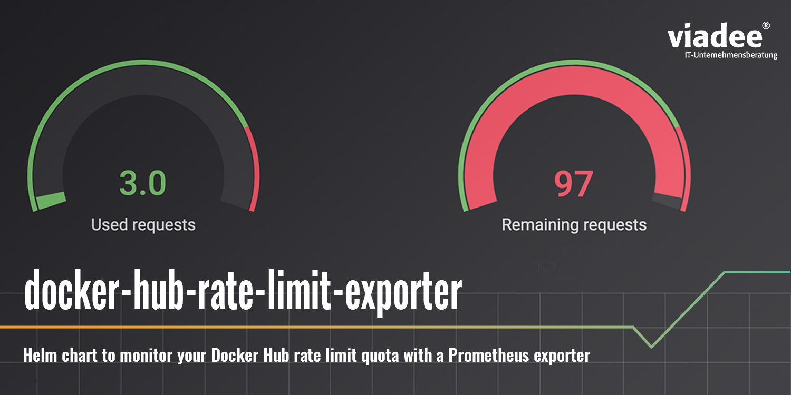

# HELM Chart for docker-hub-rate-limit-exporter

This repository enables prometheus scrapping of dockerhub rate limits by providing a ready to use docker image and helm chart.

You can find more background information in this blog post: https://blog.viadee.de/en/monitoring-the-docker-hub-rate-limit-with-prometheus

Note: The content of this repository is based on the work done by gitlab as described in their [blogpost](https://about.gitlab.com/blog/2020/11/18/docker-hub-rate-limit-monitoring/). The original source of the Python script can be found [here](https://gitlab.com/gitlab-com/marketing/corporate_marketing/developer-evangelism/code/docker-hub-limit-exporter).

## How to install the chart

The helm chart can be installed through a helm chart repository hosted on a github page in this repository. To install follow the next steps:

1. run `helm repo add viadee https://viadee.github.io/docker-hub-rate-limit-exporter`
2. run `helm install <release-name> viadee/docker-hub-rate-limit-exporter`

## How to configure your docker credentials

If your kubernetes cluster does not authenticate with dockerhub you don't need to do anything here. However, if it does, you need to configure the crendetials with helm values. This is because the docker-hub-rate-limit-exporter does not use the dockerhub account assosiated with the docker context of your kubernetes-cluster. You can configure it to do so by following the steps below:

1. Create a helm value file as per the example in this repository (see: chart/values.yaml)
2. Fill in the variables `dockerhubUsername` and `dockerhubPassword`. It is recommended to use a dockerhub access token for the password.
3. Run `helm upgrade <release name> viadee/docker-hub-rate-limit-exporter --install --namespace=<desired namespace> -f <name of value file>`

## How to tell prometheus to scrap the metrics

We recommend you to use the prometheus kubernetes operator to run prometheus in your cluster (see: https://github.com/prometheus-operator/prometheus-operator). If you run the operator you can create a `ServiceMonitor` resource to tell prometheus how to scrap the docker-hub-rate-limit-exporter. To do so follow the steps below:

1. Create a helm value file as per the example in this repository or use the value file from above (see: chart/values.yaml)
2. Set the variable `serviceMonitor.enabled` to true
3. Depending on the configuration of your Prometheus Operator you might need to configure the `serviceMonitor.additionalLabels` section to tell prometheus to scrape from this `ServiceMonitor` resource.
4. Alternatively, you might have configured the Prometheus Operator to consider all `ServiceMonitors` in a specific namespace. In that case you can set the `serviceMonitor.namespace` option to deploy the `ServiceMonitor` resource in that namespace.
5. Run `helm upgrade <release name> viadee/docker-hub-rate-limit-exporter --install --namespace=<desired namespace> -f <name of value file>`

If you are not using the prometheus kubernetes operator you would need to configure prometheus manually to scrap the metrics.

## Collaboration

This helm chart was build by viadee Unternehmensberatung AG. If you are interested to find out what else we are doing, check out our website: https://www.viadee.de/en/solutions/cloud

If you have any feedback, ideas or extensions feel free to reach out and create a GitHub issue.

trigger
